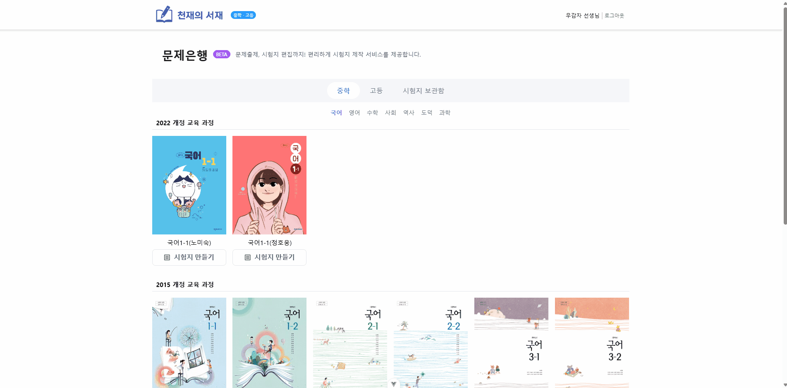
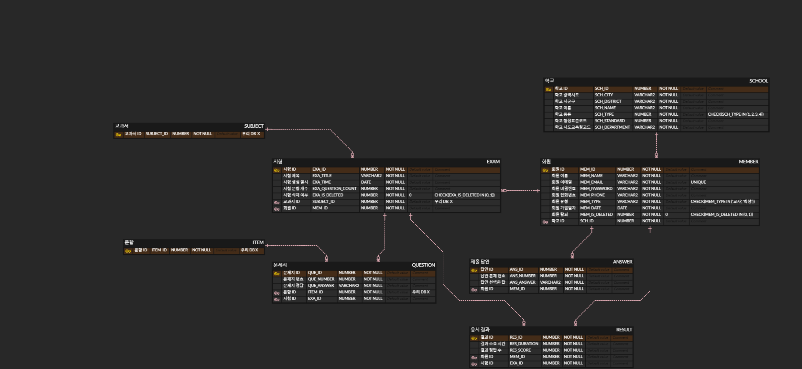

# 천재의 서재 - 교과서 기반 문제은행 서비스

  

  <b>교과서 기반의 단원별 문제를 손쉽게 생성하고 편집할 수 있는 웹 서비스입니다.</b> 
  선생님과 교육자를 위한 <b>AI 문제 생성</b>, <b>문항 편집</b>, <b>보관 및 다운로드</b> 기능을 제공합니다.

## 👥 팀 구성원

<table>
  <tr>
    <td align="center">
      <a href="https://github.com/hoonee-math">
        
         
        <b>최광훈</b>
      </a>
    </td>
    <td align="center">
      <a href="https://github.com/daineee424">
        
         
        <b>정다인</b>
      </a>
    </td>
    <td align="center">
      <a href="https://github.com/blue032">
        
         
        <b>이예진</b>
      </a>
    </td>
    <td align="center">
      <a href="https://github.com/woogamjaa">
        
         
        <b>우민혁</b>
      </a>
    </td>
    <td align="center">
      <a href="https://github.com/my2min0">
        
         
        <b>이민영</b>
      </a>
    </td>
    <td align="center">
      <a href="https://github.com/minho0802">
        
         
        <b>김민호</b>
      </a>
    </td>
  </tr>
</table>

## 🛠 기술 스택

### 🎨 Frontend

  
  
  
  

### 🧩 Backend

  
  
  
  
  

### 🗄️ Database / DevOps

  
  
  
  

### 🧑‍💻 개발 환경

  
  
  

## 📂 레포지토리

| 구분 | 링크 | 
|------|------|
| 🖥️ Frontend | [2nd_GenieQ_FrontEnd](https://github.com/ChunJae-Full-Stack-FinalProject/2nd_GenieQ_FrontEnd) 
| 🛠️ Backend  | [2nd_GenieQ_BackEnd](https://github.com/ChunJae-Full-Stack-FinalProject/2nd_GenieQ_BackEnd) 

🖥️ 프론트엔드 구조 보기

<pre><code>
├─📁 src/
│  ├─📁 assets/
│  │  ├─📁 css/
│  │  │  ├─📄 common.css
│  │  │  ├─📄 font.css
│  │  │  └─📄 reset.css
│  │  │
│  │  ├─📁 js/
│  │  │  ├─📄 common.js
│  │  │  └─📄 jquery-ui.js
│  │  │
│  │  ├─📁 json/
│  │  │  ├─📄 books.json
│  │  │  ├─📄 count.json
│  │  │  └─📄 schoolDistrict.json
│  │  │
│  │  ├─📁 policy/
│  │  │
│  │  ├─📁 scss/
│  │  │  ├─📄 _mixin.scss
│  │  │  ├─📄 _setting.scss
│  │  │  └─📄 common.scss
│  │  │
│  │  ├─📄 base.css
│  │  └─📄 main.css
│  │
│  ├─📁 components/
│  │  ├─📁 auth/
│  │  │  ├─📄 Login.vue
│  │  │  ├─📄 PasswordSearch.vue
│  │  │  ├─📄 SearchSchool.vue
│  │  │  ├─📄 SignUp.vue
│  │  │  └─📄 TempPasswordNotice.vue
│  │  │
│  │  ├─📁 common/
│  │  │  ├─📁 button/
│  │  │  │  └─📄 BaseButton.vue
│  │  │  │
│  │  │  ├─📁 modal/
│  │  │  │  ├─📁 auth/
│  │  │  │  │  ├─📄 PrivacyModal.vue
│  │  │  │  │  └─📄 TermsModal.vue
│  │  │  │  │
│  │  │  │  ├─📄 BaseModal.vue
│  │  │  │  └─📄 LoadingModal.vue
│  │  │  │
│  │  │  ├─📄 Footer.vue
│  │  │  ├─📄 Header.vue
│  │  │  └─📄 Loading.vue
│  │  │
│  │  ├─📁 paper/
│  │  │  └─📄 PaperListComponent.vue
│  │  │
│  │  └─📁 subject/
│  │     └─📄 SubjectListComponent.vue
│  │
│  ├─📁 composables/
│  │  └─📄 useParentAuth.js
│  │
│  ├─📁 plugins/
│  │  └─📄 axios.js
│  │
│  ├─📁 router/
│  │  └─📄 index.js
│  │
│  ├─📁 stores/
│  │  ├─📄 auth.js
│  │  ├─📄 paper.js
│  │  └─📄 subject.js
│  │
│  ├─📁 views/
│  │  ├─📁 paper/
│  │  │  ├─📄 PaperPopup.vue
│  │  │  ├─📄 PaperSave.vue
│  │  │  ├─📄 PaperSaveComplete.vue
│  │  │  └─📄 PaperSummary.vue
│  │  │
│  │  └─📄 HomeView.vue
│  │
│  ├─📄 App.vue
│  └─📄 main.js
│
├─📄 .env.development
├─📄 .env.production
├─📄 index.html
├─📄 jsconfig.json
├─📄 package-lock.json
├─📄 package.json
└─📄 vite.config.js
</code></pre>

🛠️ 백엔드 구조 보기

<pre><code>
└─📁 main/
   ├─📁 java/
   │  └─📁 com/
   │     └─📁 cj/
   │        └─📁 genius/
   │           ├─📁 answer/
   │           │  ├─📁 controller/
   │           │  │  └─📄 AnswerController.java
   │           │  │
   │           │  ├─📁 dto/
   │           │  │  ├─📁 request/
   │           │  │  │  └─📄 AnswerRequestDto.java
   │           │  │  │
   │           │  │  └─📁 response/
   │           │  │     ├─📄 Answer.java
   │           │  │     └─📄 AnswerResponseDto.java
   │           │  │
   │           │  ├─📁 entity/
   │           │  │  └─📄 AnswerEntity.java
   │           │  │
   │           │  ├─📁 repository/
   │           │  │  └─📄 AnswerRepository.java
   │           │  │
   │           │  └─📁 service/
   │           │     ├─📄 AnswerService.java
   │           │     └─📄 AnswerServiceImpl.java
   │           │
   │           ├─📁 common/
   │           │  └─📁 config/
   │           │     ├─📄 IsSameUser.java
   │           │     ├─📄 JwtAuthenticationFilter.java
   │           │     ├─📄 JwtTokenProvider.java
   │           │     ├─📄 SecurityConfig.java
   │           │     ├─📄 SwaggerConfig.java
   │           │     └─📄 WebMvcConfig.java
   │           │
   │           ├─📁 exam/
   │           │  ├─📁 controller/
   │           │  │  └─📄 ExamController.java
   │           │  │
   │           │  ├─📁 dto/
   │           │  │  ├─📁 request/
   │           │  │  │  ├─📄 ExamDeleteEachRequestDto.java
   │           │  │  │  ├─📄 ExamDeleteListRequestDto.java
   │           │  │  │  ├─📄 ExamInsertRequestDto.java
   │           │  │  │  ├─📄 ExamSelectAllRequestDto.java
   │           │  │  │  └─📄 ExamSelectEachRequestDto.java
   │           │  │  │
   │           │  │  ├─📁 response/
   │           │  │  │  ├─📄 ExamSelectAllResponseDto.java
   │           │  │  │  ├─📄 ExamSelectEachResponseDto.java
   │           │  │  │  └─📄 ExamSelectResponseDto.java
   │           │  │  │
   │           │  │  └─📄 Exam.java
   │           │  │
   │           │  ├─📁 entity/
   │           │  │  └─📄 ExamEntity.java
   │           │  │
   │           │  ├─📁 repository/
   │           │  │  └─📄 ExamRepository.java
   │           │  │
   │           │  └─📁 service/
   │           │     ├─📄 ExamService.java
   │           │     └─📄 ExamServiceImpl.java
   │           │
   │           ├─📁 member/
   │           │  ├─📁 controller/
   │           │  │  └─📄 MemberController.java
   │           │  │
   │           │  ├─📁 dto/
   │           │  │  ├─📁 request/
   │           │  │  │  ├─📄 FindPasswordRequestDto.java
   │           │  │  │  ├─📄 LoginRequestDto.java
   │           │  │  │  ├─📄 SignUpRequestDto.java
   │           │  │  │  └─📄 WithdrawRequestDto.java
   │           │  │  │
   │           │  │  ├─📁 response/
   │           │  │  │  ├─📄 FindEntireResponseDto.java
   │           │  │  │  └─📄 LoginMemberResponseDto.java
   │           │  │  │
   │           │  │  ├─📄 Member.java
   │           │  │  └─📄 TokenResponseDto.java
   │           │  │
   │           │  ├─📁 entity/
   │           │  │  └─📄 MemberEntity.java
   │           │  │
   │           │  ├─📁 repository/
   │           │  │  └─📄 MemberRepository.java
   │           │  │
   │           │  └─📁 service/
   │           │     ├─📄 AuthService.java
   │           │     ├─📄 AuthServiceImpl.java
   │           │     └─📄 CustomUserDetailsService.java
   │           │
   │           ├─📁 pdf/
   │           │  ├─📁 config/
   │           │  │  └─📄 AppConfig.java
   │           │  │
   │           │  ├─📁 controller/
   │           │  │  └─📄 PdfController.java
   │           │  │
   │           │  ├─📁 dto/
   │           │  │  ├─📄 ExamRequestDto.java
   │           │  │  ├─📄 ExamResponseDto.java
   │           │  │  ├─📄 ItemDetailDto.java
   │           │  │  └─📄 QuestionDto.java
   │           │  │
   │           │  ├─📁 repository/
   │           │  │  ├─📄 PdfRepository.java
   │           │  │  └─📄 PdfRepositoryImpl.java
   │           │  │
   │           │  └─📁 service/
   │           │     ├─📄 ExamItemService.java
   │           │     └─📄 ExamPdfService.java
   │           │
   │           ├─📁 question/
   │           │  ├─📁 controller/
   │           │  │  └─📄 QuestionController.java
   │           │  │
   │           │  ├─📁 dto/
   │           │  │  ├─📁 request/
   │           │  │  │  └─📄 QuestionInsertRequestDto.java
   │           │  │  │
   │           │  │  └─📁 response/
   │           │  │     └─📄 QuestionResponseDto.java
   │           │  │
   │           │  ├─📁 entity/
   │           │  │  └─📄 QuestionEntity.java
   │           │  │
   │           │  ├─📁 repository/
   │           │  │  └─📄 QuestionRepository.java
   │           │  │
   │           │  └─📁 service/
   │           │     ├─📄 QuestionService.java
   │           │     └─📄 QuestionServiceImpl.java
   │           │
   │           ├─📁 result/
   │           │  ├─📁 controller/
   │           │  │  └─📄 ResultController.java
   │           │  │
   │           │  ├─📁 dto/
   │           │  │  ├─📁 request/
   │           │  │  │  └─📄 ResultRequestDto.java
   │           │  │  │
   │           │  │  └─📁 response/
   │           │  │     ├─📄 Result.java
   │           │  │     └─📄 ResultResponseDto.java
   │           │  │
   │           │  ├─📁 entity/
   │           │  │  └─📄 ResultEntity.java
   │           │  │
   │           │  ├─📁 repository/
   │           │  │  └─📄 ResultRepository.java
   │           │  │
   │           │  └─📁 service/
   │           │     ├─📄 ResultService.java
   │           │     └─📄 ResultServiceImpl.java
   │           │
   │           ├─📁 school/
   │           │  ├─📁 controller/
   │           │  │  └─📄 SchoolController.java
   │           │  │
   │           │  ├─📁 dto/
   │           │  │  ├─📁 request/
   │           │  │  │  └─📄 SchoolRequestDto.java
   │           │  │  │
   │           │  │  └─📁 response/
   │           │  │     ├─📄 School.java
   │           │  │     └─📄 SchoolResponseDto.java
   │           │  │
   │           │  ├─📁 entity/
   │           │  │  └─📄 SchoolEntity.java
   │           │  │
   │           │  ├─📁 repository/
   │           │  │  └─📄 SchoolRepository.java
   │           │  │
   │           │  └─📁 service/
   │           │     ├─📄 SchoolService.java
   │           │     └─📄 SchoolServiceImpl.java
   │           │
   │           ├─📁 test/
   │           │  ├─📄 TestController.java
   │           │  └─📄 TestCustomUserDetailsService.java
   │           │
   │           └─📄 GeniusApplication.java
   │
   ├─📁 resources/
   │  ├─📁 fonts/
   │  │
   │  ├─📁 images/
   │  │  ├─📄 genius_library_logo.png
   │  │  ├─📄 genius_library_logo_two_rows.png
   │  │  └─📄 logo_row_no_margin.png
   │  │
   │  ├─📁 initdata/
   │  │
   │  ├─📄 application-private.properties
   │  ├─📄 application-private.properties.template
   │  ├─📄 application.properties
   │  └─📄 datasource.properties
   │
</code></pre>

## ✨ 주요 기능

### 📝 문제 생성 및 편집 
교과서 단원별로 제공되는 문제를 선택하여, 시험지를 자유롭게 구성하고 편집할 수 있습니다. 

### 📄 시험지 다운로드
완성된 시험지는 PDF, Word, TXT 형식으로 다운로드할 수 있어 수업에 바로 활용할 수 있습니다.

## 🗂 ERD 설계도

천재의 서재 데이터베이스 구조를 시각적으로 표현한 ERD입니다.

